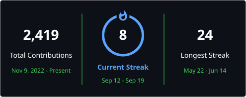

<div align="center">

# `natinael mequanent`

**full-stack · systems thinker · builder**

Addis Ababa, Ethiopia 🇪🇹

[](https://github.com/natinael96)
[](https://linkedin.com/in/natinael-mequanent-b861492a5)
[](https://leetcode.com/natinael96)

</div>

---

### `> stack`


&nbsp;·&nbsp;


&nbsp;·&nbsp;


&nbsp;·&nbsp;


---

### `> featured`

**🩺 [blood-pressure-prediction](https://github.com/natinael96/finalproj_ml)** — Predicts SBP/DBP from **live** ECG + PPG signals streamed off an ESP32. PTT/HRV feature engineering → multi-output RandomForest → FastAPI → real-time Next.js dashboard.
<sub>`Python` `FastAPI` `Next.js` `scikit-learn` `Supabase` `C++`</sub>

**💼 [job-board-platform-api](https://github.com/natinael96/Job-Board-Platform-Backend-API)** — Production-grade REST API. Full RBAC, JWT auth, indexed Postgres, Redis caching, rate limiting, Dockerised, test-covered.
<sub>`Django REST` `PostgreSQL` `Redis` `Docker`</sub>

**🔗 [graphql-crm](https://github.com/natinael96/alx-backend-graphql_crm)** — Django CRM behind a full GraphQL API, with Celery-driven automation: stock alerts, weekly reports, cleanup jobs.
<sub>`Django` `GraphQL` `Celery` `Redis`</sub>

<sub>**also:** [kanban board](https://github.com/natinael96/kanban-task-management) `Vue` · [blood donation](https://github.com/natinael96/blood_donation) `TS` · [property caching](https://github.com/natinael96/alx-backend-caching_property_listings) `Redis` · [backend security](https://github.com/natinael96/alx-backend-security) `Django` · [DSA](https://github.com/natinael96/DSA) + [CP](https://github.com/natinael96/Competitive-Programming)</sub>

---

### `> currently`

```diff
+ building  → ESP32 × ML × real-time biosignals
+ grinding  → leetcode.com/natinael96
+ learning  → system design · distributed systems
  open_to   → collabs · open-source · interesting problems
```

---

<div align="center">

<a href="https://git.io/streak-stats"></a>

<sub>*"First, solve the problem. Then, write the code."*</sub>


</div>
